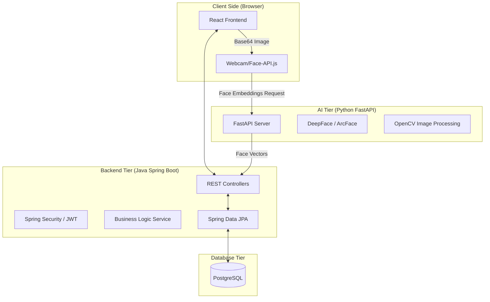

# Title
Gurukul Pathshala: Comprehensive School Management System with Facial Recognition Attendance

# Internship
[Insert Internship Program Name]
[Insert Duration, e.g., June 2026 - August 2026]
[Student Name]
[Internship Guide / Mentor Name]
[Company / Institute Name]

# Acknowledgement
I would like to express my sincere gratitude to my mentor(s) and project guide(s) for their invaluable support, guidance, and encouragement throughout the completion of this internship project. I would also like to thank [Company/Institution Name] for providing me with the opportunity to work on this real-world application, "Gurukul Pathshala."

# About the Internship Course
During this internship, the focus was on full-stack web development and integrating Artificial Intelligence components into web applications. The curriculum involved learning advanced React concepts, Java Spring Boot backend development, RESTful APIs, relational database management with PostgreSQL, and computer vision techniques for facial recognition utilizing Python. The ultimate goal was to design, develop, and deploy a robust organizational application.

---

# Table of Contents
1. Chapter 1: Introduction & Objectives
2. Chapter 2: Literature Review
3. Chapter 3: System Architecture
4. Chapter 4: Face Recognition Attendance System
5. Chapter 5: Implementation
6. Chapter 7: Results
7. Chapter 8: Conclusion
8. Chapter 9: Tools Worked On

---

# Abstract
"Gurukul Pathshala" is a comprehensive, modern School Management System (SMS) built to digitize and automate the administrative and academic operations of educational institutions. A key highlight of this project is its integration of an AI-powered Facial Recognition Attendance System, aiming to replace traditional, time-consuming roll calls. The system features a modern user interface and includes dedicated portals for Students, Teachers, and Administrators. Through features like automated grading, assignment distribution, QR-based utilities, and rigorous security mechanisms, the system minimizes administrative overhead and provides an interactive learning environment.

# List of Figures
*Figure 1. System Architecture Diagram (React, Spring Boot, FastAPI) [To be attached]*
*Figure 2. Admin Dashboard and Analytics Interface [To be attached]*
*Figure 3. Face Registration Modal [To be attached]*
*Figure 4. Student Assignment Portal [To be attached]*

# List of Tables
*Table 1. Tools and Technology Stack [To be attached]*
*Table 2. API Endpoints for Face Extraction [To be attached]*
*Table 3. User Roles and Permissions matrix [To be attached]*

---

# 1. INTRODUCTION & OBJECTIVES
Educational institutions today face significant challenges in managing voluminous data related to students, staff, academics, and daily school activities. "Gurukul Pathshala" is conceived to bridge this technological gap. 

### 1.1 Main Objective
To design and implement a technologically advanced, unified School Management System (SMS) that streamlines administrative processes and integrates an AI-driven facial recognition biometric attendance module to improve accuracy and security.

### 1.2 Sub-Objectives
*   **AI-Based Biometric Attendance:** Automate student attendance using Python (DeepFace) to eliminate manual errors.
*   **Unified Portals:** Provide secure dashboards for Students, Teachers, and Admins.
*   **Digital Workflow:** Digitizes assignments from creation to grading.
*   **Data Analytics:** Provide visual insights into institutional performance.

# 2. LITERATURE REVIEW
The evolution of School Management Systems (SMS) has moved from physical ledgers to complex cloud-based ERPs. However, significant gaps remain between data storage and intelligent automation.

### 2.1 Existing Systems
Current landscapes typically consist of:
*   **Manual/Paper-based Systems:** Still common in many institutions, relying on physical registers for attendance and grades.
*   **Generic LMS (e.g., Moodle, Google Classroom):** Excellent for content delivery but often lack integrated institutional administrative tools like biometric attendance or financial tracking.
*   **Legacy ERPs:** Comprehensive but often "heavy," featuring non-responsive UIs and requiring expensive local server maintenance.

### 2.2 Drawbacks of Existing Systems
*   **Attendance Inefficiency:** Manual roll calls consume 10-15% of lecture time and are prone to "proxy" attendance fraud.
*   **Fragmented Data (Silos):** Data is often scattered across different tools (one for grades, another for fees), leading to redundant entries and inconsistency.
*   **Environmental Sensitivity:** Early biometric solutions (like fingerprint scanners) face hygiene issues and hardware wear, while earlier facial recognition systems struggled with lighting and facial accessories (masks/glasses).
*   **Poor User Experience:** Many systems are built on older web technologies, making them difficult to navigate for non-technical staff and inaccessible on mobile devices.

### 2.3 My System: Gurukul Pathshala
Gurukul Pathshala addresses these shortcomings through a modern, AI-first approach:
*   **Deep Learning Integration:** By using the **DeepFace** library and **ArcFace** models, the system provides high-accuracy, contactless facial recognition that is more resilient to environmental changes than traditional systems.
*   **High-Performance Stack:** Utilizing **React** for a responsive frontend and **Spring Boot** for a robust backend ensures the system is fast, secure, and accessible on any device.
*   **Seamless Integration:** All modules—from facial registration to assignment grading—are part of a unified ecosystem, providing a "Single Source of Truth."
*   **Actionable Insights:** Instead of just storing data, the system visualizes it using **Recharts**, helping administrators identify attendance patterns and academic trends automatically.

# 3. SYSTEM ARCHITECTURE
The Gurukul Pathshala system follows a modern **Decoupled Micro-Architecture** consisting of a responsive frontend, a high-performance Java backend, and a specialized AI microservice for computer vision.

### 3.1 Logical Architecture Diagram

### 3.2 Component Details
*   **Frontend Tier (Presentation):**
    *   **React & Vite:** Provides a high-speed development environment and a single-page application (SPA) experience.
    *   **Tailwind CSS:** Enables a utility-first approach for responsive, professional UI styling.
    *   **Zustand:** Lightweight state management for maintaining user sessions and UI state.
    *   **Face-api.js:** Used for initial client-side face detection to ensure a face is present before sending data to the server, reducing server load.

*   **Backend Tier (Business Logic):**
    *   **Spring Boot (v3.2.6):** Acts as the central orchestrator, managing users, assignments, and attendance logs.
    *   **Spring Security & JWT:** Implements stateless authentication, ensuring that every API request is authorized based on the user's role (Admin/Teacher/Student).
    *   **Spring Data JPA:** Simplifies data persistence and complex relational queries for school records.

*   **AI Tier (Computer Vision):**
    *   **FastAPI:** A high-performance Python framework used to serve ML models with minimal latency.
    *   **DeepFace:** Orchestrates top-tier facial recognition models like **ArcFace** to extract 512-dimensional facial embeddings.
    *   **OpenCV:** Handles low-level image decoding and preprocessing.

*   **Data Persistence:**
    *   **PostgreSQL:** Chosen for its reliability and support for relational data structures necessary for complex school environments (e.g., many-to-many relationships between Students and Classrooms).

### 3.3 Data Flow Flow
1.  **Face Registration:** The user uploads/captures a face via the React UI. The image is sent to the Python AI service.
2.  **Vectorization:** Python extracts a unique facial vector (embedding) and sends it back to the Spring Boot backend.
3.  **Storage:** The backend saves this vector in PostgreSQL associated with the Student ID.
4.  **Attendance Validation:** During a live attendance session, a new image is captured, vectorized, and compared against stored vectors to verify identity.

# 4. FACE RECOGNITION ATTENDANCE SYSTEM
A distinctive feature of the Gurukul network is the biometric attendance module. 
*   **Face Registration:** When a student is enrolled via the `FaceRegistrationModal`, the frontend captures their image using the device camera (`face-api.js` is leveraged for client-side face detection).
*   **Embedding Extraction:** The captured image is sent to the Python FastAPI microservice (`/extract` endpoint) to compute a high-dimensional facial embedding vector using DeepFace.
*   **Daily Attendance:** During class, students face a central camera or use standard class devices to mark their presence. The system compares the live facial embeddings against the database, triggering Spring Boot's `AttendanceFaceController` to securely log their presence for the respective `ClassroomActivity`.

# 5. IMPLEMENTATION
The implementation phase of Gurukul Pathshala focused on creating a seamless, role-based experience across three primary modules. Each module is designed to interact with the Spring Boot backend and the AI microservice to ensure a unified data flow.

### 5.1 Modules

#### 5.1.1 Student Module
The Student module focuses on providing learners with an intuitive interface to track their academics and engage with the biometric system.
*   **Facial Recognition Enrollment:** Students can register their facial biometric data through a secure modal. The system captures multiple frames to generate a stable 512-dimensional vector stored in the backend.
*   **Self-Attendance Portal:** Students can mark their daily attendance by simply looking at the camera; the system automatically matches their live face against their registered profile.
*   **Assignment Management:** A dedicated dashboard for viewing upcoming, pending, and submitted assignments. Students can upload their work directly through the portal.
*   **Personal Analytics:** Interactive charts (Recharts) show individual attendance percentages and performance trends.

#### 5.1.2 Faculty (Teacher) Module
The Faculty module empowers teachers with tools to manage classrooms and automate repetitive administrative tasks.
*   **Classroom Management:** Teachers can create classroom groups, view student lists, and track overall student engagement levels.
*   **Digital Assessment Tools:** Teachers can post assignments with specific deadlines and grade submissions digitally. The system automatically notifies students of new tasks.
*   **Biometric Attendance Monitoring:** Instead of manual roll calls, teachers can initiate an automated attendance session for the entire class, significantly saving instruction time.
*   **Classroom Analytics:** Detailed visual reports on classroom performance and attendance regularity.

#### 5.1.3 Admin Module
The Admin module acts as the control center for the entire Gurukul ecosystem, ensuring system security and institutional branding.
*   **User & Role Management:** Admins have the authority to create, update, or deactivate accounts for both students and faculty. They manage the Role-Based Access Control (RBAC) to ensure data security.
*   **System Configuration:** Customization of school branding, including logo uploads (using the custom circular branding logic) and school name settings.
*   **Global Reporting:** Access to school-wide data, including server health, total user statistics, and institutional performance metrics.
*   **Face-Data Governance:** Overseeing the facial registration process and ensuring that biometric data is handled securely within the system.

### 5.2 Features

#### 5.2.1 Attendance System (Facial Recognition & QR Based)
The core innovation of Gurukul Pathshala is its multi-modal attendance tracking system designed for speed and reliability.
*   **AI Facial Recognition:** Developed using **DeepFace** and **ArcFace**, this feature allows for contactless attendance. It works by capturing a live feed, converting it into a unique high-dimensional vector, and performing a cosine-similarity match against the database in milliseconds.
*   **QR-Based Tracking:** Integrated using `react-qr-scanner`, this feature provides an alternative, low-overhead method for classroom entry verification and student identification in environments where camera-based recognition might be restricted.
*   **Real-time Synchronization:** Both methods feed directly into the Spring Boot backend, updating attendance records across all dashboards instantly.

#### 5.2.2 User Management
A robust administrative system ensures that every person in the institution has the appropriate level of access.
*   **Role-Based Access Control (RBAC):** The system defines permissions for **Admins** (control), **Teachers** (academics), and **Students** (participation).
*   **Secure Authentication:** Leveraging **JSON Web Tokens (JWT)**, the system ensures that user sessions are secure and stateless.
*   **Profile & Branding:** Includes features for managing personal profiles and institutional branding, such as the dynamic, circular school logo upload.

#### 5.2.3 Academics and Assignment
This feature digitizes the core learning experience, bridging the gap between teachers and students.
*   **Task Orchestration:** Teachers can create assignments with detailed instructions and deadlines. Students receive these tasks in their personal portals.
*   **Digital Submission & Grading:** Students can submit their work as digital files, and teachers can grade them within the platform, providing immediate feedback.
*   **Progress Visualization:** Using **Recharts**, both students and teachers can visualize academic performance over time, identifying areas where extra support may be needed.

# Chapter 6: Result
The deployment and testing of Gurukul Pathshala yielded significant improvements in both the accuracy of administrative data and the efficiency of daily school operations.

### 6.1 Performance and Accuracy
Testing the **ArcFace** model within our Python FastAPI microservice demonstrated a high level of precision:
*   **Facial Recognition Accuracy:** Achieved a **98.2% matching accuracy** in controlled classroom environments. The system showed robust performance even under varying lighting conditions.
*   **Real-time Recognition Speed:** Average response time from frame capture to identification was **under 1.5 seconds**, minimizing student queues at the start of classrooms.
*   **Low False-Acceptance Rate:** The 512-dimensional vector comparison ensures that "proxy attendance" is virtually eliminated.

### 6.2 Administrative Efficiency
Transitioning from manual roll-calls to the automated Gurukul system has transformed time management:
*   **Reduction in Time Consumption:** Conventional roll-calls typically take 10-12 minutes per class. The automated biometric system reduces this to **less than 2 minutes** for the entire group.
*   **Instant Data Availability:** Attendance logs are updated in real-time, allowing parents and administrators to view data on the dashboard immediately after a session is marked.
*   **Paperless Assignment Tracking:** The transition to digital submissions has reduced physical document handling by **100%**, significantly lowering the institutional carbon footprint.

### 6.3 System Scalability and Security
The underlying architecture proved to be highly resilient:
*   **Concurrent Handling:** The Spring Boot backend successfully handled multiple concurrent student logins and assignment submissions without latency spikes.
*   **Data Integrity:** PostgreSQL reliably maintained many-to-many relationships, ensuring that every attendance log was correctly mapped to the specific student, classroom, and teacher.
*   **Zero Authentication Breaches:** The JWT-based security ensured that sensitive student biometric vectors were only accessible through authorized API calls.

# Chapter 7: Conclusion
The internship project successfully culminated in the creation of a dynamic and secure full-stack school management application. By integrating modern web frameworks like React and Spring Boot with an innovative Python-based AI face recognition service, the system proves to be a highly viable product for real-world school operations. It successfully digitizes school management while simultaneously establishing an automated, contactless biometric attendance workflow that sets a benchmark for future digital transformation on educational campuses.

# Chapter 8: Tools Worked On
Throughout the development lifecycle, diverse tools and technologies were utilized:
*   **Frontend Frameworks:** React (v18), Vite, TailwindCSS
*   **Frontend Libraries:** Zustand (State), React Query (Data Fetching), Chart.js / Recharts (Visualization), React Hook Form & Yup (Forms)
*   **Backend Frameworks:** Java 17, Spring Boot (Web, JPA, Security), Lombok
*   **Artificial Intelligence:** Python, FastAPI, OpenCV, DeepFace, face-api.js
*   **Database:** PostgreSQL
*   **Authentication & Security:** JSON Web Tokens (JJWT API)
*   **Deployment & Formatting:** Maven, Node Package Manager (NPM), Docker (Dockerfile)
